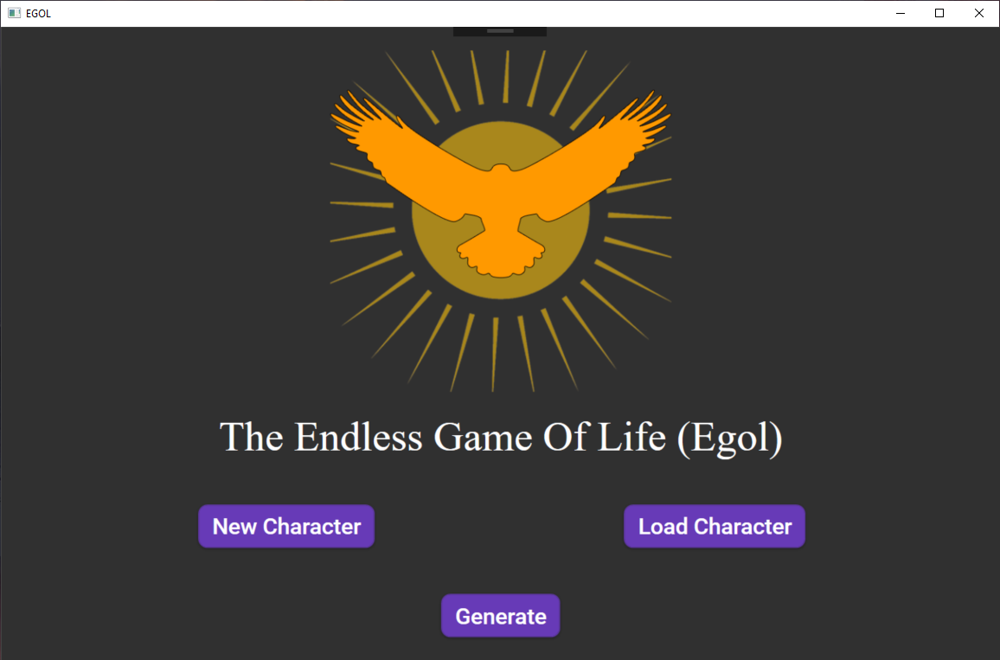
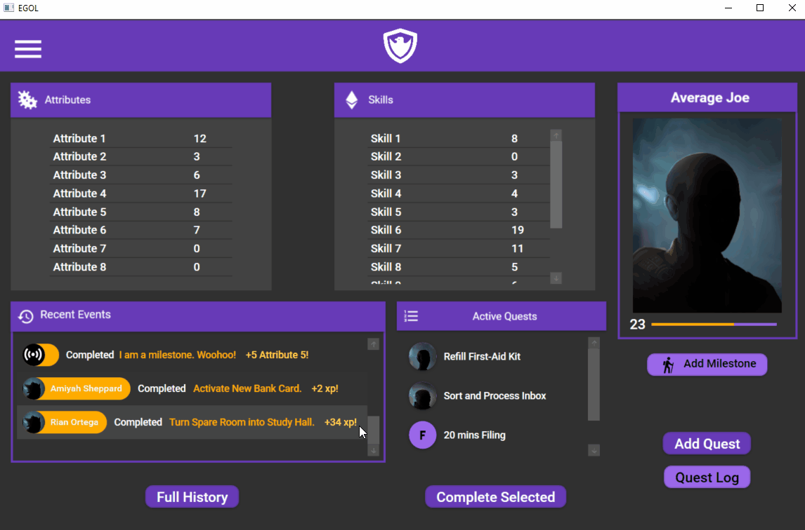
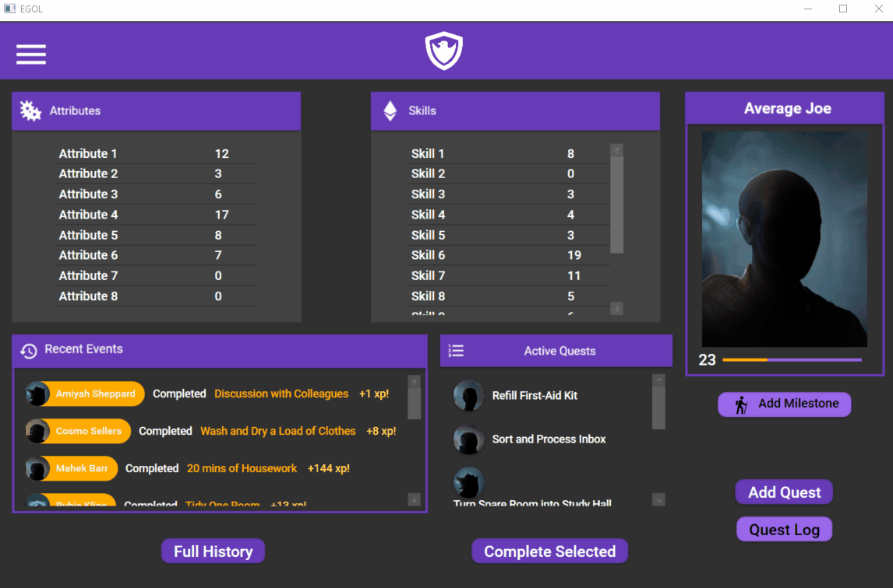

# EGOL (The Endless Game of Life)

A C# .Net desktop app for tracking character progression through quests completion. This was created at the request of an individual who found available "gamify" apps did not fit his criteria. It is built on the Windows Presentatin Foundation (WPF) using a Model-View-ViewModel (MVVM) architecture.

## In Action

### Splash Screen



### Dashboard Navigation



### The Quest Log



## Motivation

As mentioned, this app was created at the request of a client who wanted to [gamify](https://en.wikipedia.org/wiki/Gamification) their life, but did not like any of the available options. My personal motivations were as follows:

1. Gain familiarity with building a C# GUI-based app utilizing the .Net framework
1. Learn how to apply the MVVM architecture
1. Successfully use serialization/deserialization to store persistent data in XML

My first instinct was to just bundle SQLite with the app to handle all the persistent data, but the client requested that it instead be handled with a local XML file.

## Basic Feature Overview

* Create/Generate a base character with different values for attributes/skills
* Customize what attributes/skills are used
* Create and complete quests to gian experience
* Gain experience to gain levels, which reward attribute and skill points
* Create contacts who give quests and each possess their own reputation value for the character
* Create milestones (major achievements) that permanently boost a character's attribute

## Running It

### Option 1 (Executable)

1. Clone the Repo

    ```shell
    git clone https://github.com/cplant1776/egol.git
    ```

1. Run the executable

    ```shell
    CharSheet\EgolApp\bin\Release\Egol.exe
    ```

### Option 2 (Visual Studio)

1. Clone the Repo

    ```shell
    git clone https://github.com/cplant1776/egol.git
    ```

1. Import the solution to Visual Studio (2017+)

    ```shell
   CharSheet\CharSheet.sln
    ```

## To-Do

The app meets all the client's original criteria, and I therefore do not plan to develop this project further. If I were going to, I would look into the following:

1. Adding basic unit tests (the biggest advantage of MVVM)
1. Convert persistent data to local SQLite instance (Lower memory footprint)
1. Adjust filter on New Quest screen to search dynamically (as-is it will eventually run sluggish with lots of completed quests)
